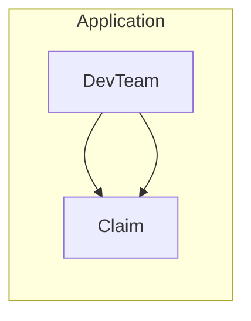

```mermaid
sequenceDiagram
autonumber
    Developer-->>Git: Create a repository from template and trigger CI
    Git-->>Flux: Register repo as a Source
    Flux-->>Flux: Creaate base Kustomization from the template folder
    Flux-->>Crossplane: Push base claims to the cluster
    Crossplane-->>Cloud Resources: Build base Infrastructure with Crossplane
    Cloud Resources-->>Developer: Consume cloud resources
```

```mermaid
flowchart LR
    subgraph Application
    DevTeam-->Claim
    end
        subgraph Application
    DevTeam-->Claim
    end


```