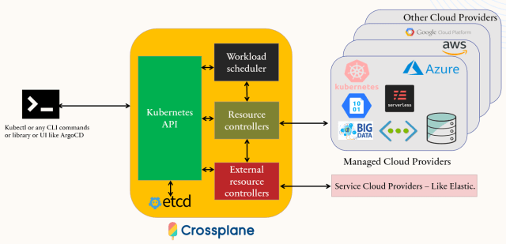
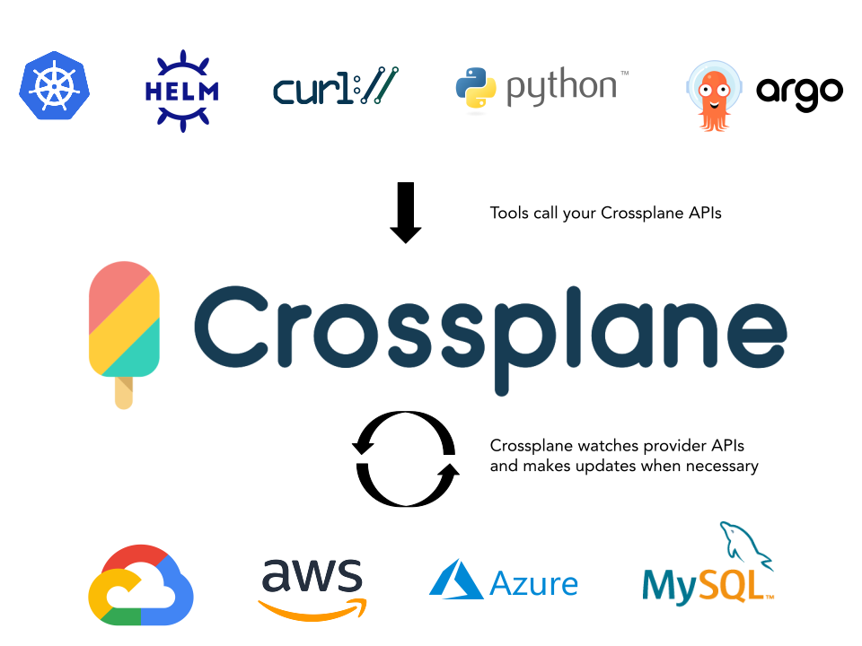
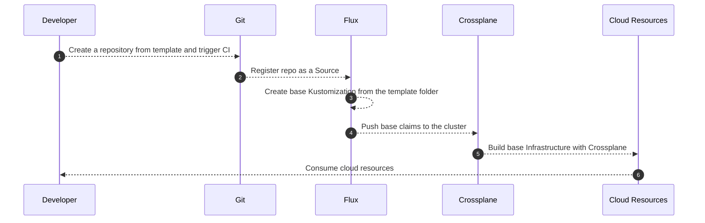
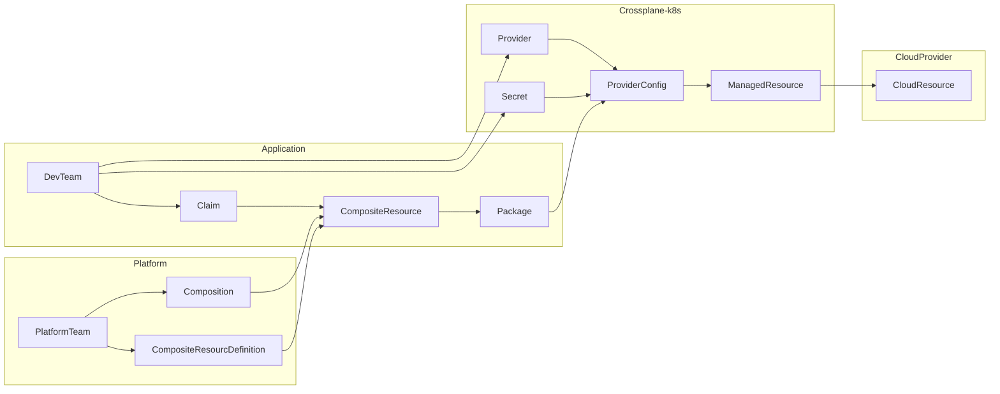

# Overview
- Developers, DevOps, App Operators are using different tools and methods to maintain infrastructure hosted in multiple platforms, deploying and maintaining applications into those infrastructures.
- Building culture isn’t just about communication and shared values — it’s also about tools.
- To deliver high-quality code fast and safely, we need a good developer platform.
- Let's build our common platforms like the cloud vendors build theirs - with a unified control plane.

## What is Crossplane
Crossplane is a powerful tool for managing cloud-native infrastructure using a Kubernetes-style API.
That one of UCP concept implementations.



## Demo goals
- show crossplane capabilities, based on simple cloud deployment
- use crossplane to create an opinionated offering to order and deploy azure RG and SA
- create composition, to expose only a minimum amount of params

## Why k8s for infrastructure provisioning
Kubernetes is powerful for two big reasons.

- The first is that Kubernetes allows you to treat multiple host
servers - or "Nodes" - as a single computer. This means that
Kubernetes will auto-schedule your containers to Nodes
that have room for them.
- The second reason Kubernetes is powerful is because of its
declarative API. "Declarative" means that you "declare" your
desired state in a file, apply it to a cluster, and Kubernetes
takes care of the rest, deploying your resources and "making it
so." Rather than running imperative, "verb" commands like "run
this container," Kubernetes' declarative model has you write
down your "nouns."

The Kubernetes API Server is the central, most important part
about a cluster because it’s the source of truth for both the
desired and actual state of your cluster’s resources.


## Crossplane vs Terraform

- Both allow engineers to model their infrastructure as
declarative configuration
- Both support managing a myriad of diverse infrastructures using
"provider" plugins
- Both are open-source tools with strong communities
- The key difference is that Crossplane is a control plane, where
Terraform is a command-line tool - an interface to control
planes.
- The Crossplane equivalent of a Terraform module is a
Composite Resource
- Terraform sits in front of many APIs, but it does not offer its
own.
- Teams automate by committing their Terraform
configuration(s) to revision control  (git) and executing
Terraform as part of their CI/CD pipeline.
- Terraform is a command line tool  - not a control plane.

## Crossplane flow
### High Level



## Implementation


```mermaid
flowchart TB
    B[Install Kind (k8s)]-->C[Install Crossplane Azure Provider]-->D[Create k8s Azure credentials]-->E[Install ProviderConfig]-->F[Create CompositeResource to Deploy RG and SA]-->G[Create Flux Infra repo]-->H[Create Flux Claim repo]-->I[Install and configure Flux]-->J[Claim for the resources]
```

## GitOps Flow




## Low Level




## Tools
- Flux as GitOps, but the same could be achieved with ArgoCD or Rancher Fleet
- Kind k8s cluster, AKS, EKS, or any managed service is fine too
- kubectl
- GitHub (Flux infra repository, claim repository)
- Crossplane and Crossplane CLI
- Azure/AWS credentials
- Azure/AWS provider
